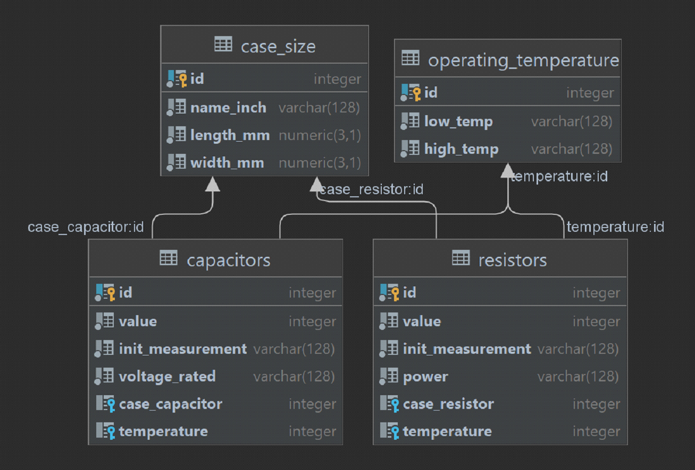

#Introduction

Software represent CRUD application. That is allowed to manipulation set of passive electronic component and their properties.

#Non-functional requirements

* API: HTTP, request and response message - JSON format; 
* JDK 16+; 
* Maven 3.6+; 
* Database PostgreSQL. 
* Docker-machine. 

#Functional requirements

The application must create, delete, update, select elements from database depending on http request will show information about capacitors and resistors. 

Http request should be for {element} where {element} is capacitor, resistor:

⦁	GET localhost:8081/{element}/search?{filter} - application should send response body with information about element in JSON type. Http response should be contained 200 codes if the requested resource was found.

Possible filters: 
&#8658; case - 0402, 0603, 0805, 1210; 
&#8658; value - digit value; 
&#8658; voltage - digit value + symbol "V" only for capacitor. Example : 25V"; 
&#8658; power - double value + symbol "W" only for resistor. Example : 0.1W"; 
&#8658; unit - for capacitor - pF|uF, for resistor - Ohm|kOhm; 
&#8658; temp-low - digit value. Example: -65°C ; 
&#8658; temp-high - digit value. Example: +55°C ; 

⦁	POST localhost:8081/ {element} /create - create element base on request body - json-type. Http response should be contained 201 codes if element create.  
The request should contain: 
Resistor: value, unit, power, case, temp-low,temp-high.
Capacitor: value, unit, voltage, case, temp-low,temp-high.

⦁	DELETE localhost:8081/ {element} /delete - delete element base on request body - json-type. Http response should be contained 204 codes if the requested was successful. 

⦁	POST localhost:8081/ {element} /update - update element base on request body - json-type. Http response should be contained 201 codes if the requested was successful. 
The request should contain: 
Resistor: id, value, unit, power.
Capacitor: id, value, unit, voltage.

⦁	Other request should be ignored and response code 404.

Main structure database represents on pictures.

#Use case

$ git clone https://github.com/Hardziyevich/application

###Create capacitor:

Request: 

Method: POST 
URL: http://localhost:8081/capacitor/create  
Headers:Content-type - application/json 
Json body: 
{ 
    "value":15, 
    "unit":"pF", 
    "voltage":"25V", 
    "case":"0402", 
    "temp-low":"-55°C", 
    "temp-high":"+125°C" 
} 

Response: http status - 201. 

###DELETE capacitor:

Request: 

Method: DELETE 
URL: http://localhost:8081/capacitor/delete?id=1  

Response: http status - 204. 

###Update capacitor request:

Request: 

Method: POST 
URL: http://localhost:8081/capacitor/update  
Headers:Content-type - application/json 
Json body: 
{ 
"id":12, 
"value":193, 
"unit":"pF", 
"voltage":"11V" 
} 

Response: http status - 201. 

###Search capacitor request:

Request: 

Method: GET 
URL: http://localhost:8081/capacitor/search?case=0603  

Response: 
http status - 200. 
Json body: 
{ 
"unit": "pF", 
"temp-high": "+175°C", 
"temp-low": "-65°C", 
"value": 100, 
"case": "0603", 
"voltage": "50V" 
}{ 
"unit": "pF", 
"temp-high": "+175°C", 
"temp-low": "-65°C", 
"value": 193, 
"case": "0603", 
"voltage": "11V" 
} 

###Create resistor:

Request: 

Method: POST 
URL: http://localhost:8081/resistor/create  
Headers:Content-type - application/json 
Json body: 
{ 
"value":15, 
"unit":"Ohm", 
"power":"0.1W", 
"case":"0402", 
"temp-low":"-55°C", 
"temp-high":"+125°C" 
} 

Response: http status - 201. 

###DELETE resistor:

Request: 

Method: DELETE 
URL: http://localhost:8081/resistor/delete?id=6  

Response: http status - 204. 

###Update resistor request:

Request: 

Method: POST 
URL: http://localhost:8081/resistor/update  
Headers:Content-type - application/json 
Json body: 
{ 
"id":12, 
"value":193, 
"unit":"Ohm", 
"power":"0.25W" 
} 

Response: http status - 201. 

###Search resistor request:

Request: 

Method: GET 
URL: http://localhost:8081/resistor/search?value=10&unit=kOhm  

Response:
http status - 200. 
Json body: 
{ 
"unit": "kOhm", 
"temp-high": "+105°C", 
"temp-low": "-55°C", 
"power": "0.1W", 
"value": 10, 
"case": "0603" 
}

#Test case

All application covered integration test.

#User guide

###Compile project and create container

git clone https://github.com/Hardziyevich/application  
cd ./application 
mvn clean package 
docker build -t jar -f docker/Dockerfile .  
cd ./docker-compose  
docker compose up

curl example for request: 

Capacitor: 

Search: curl -X GET http://localhost:8081/capacitor/search?id=1  
Delete: curl -X DELETE http://localhost:8081/capacitor/delete?id=1  
Update: curl -X POST http://localhost:8081/capacitor/update -H 'Content-Type: application/json' -d '{"id":1,"value":200,"unit":"pF","voltage":"11V"}'  
Create: curl -X POST http://localhost:8081/capacitor/create -H 'Content-Type: application/json' -d '{"value":115,"unit":"pF","voltage":"25V","case":"0402","temp-low":"-55°C","temp-high":"+125°C"}'  

Resistor: 

Search: curl -X GET http://localhost:8081/resistor/search?value=10&unit=kOhm  
Delete: curl -X DELETE http://localhost:8081/resistor/delete?id=1  
Update: curl -X POST http://localhost:8081/resistor/update -H 'Content-Type: application/json' -d '{"id":1,"value":120,"unit":"Ohm","power":"0.25W"}'  
Create: curl -X POST http://localhost:8081/resistor/create -H 'Content-Type: application/json' -d '{"value":15,"unit":"kOhm","power":"0.1W","case":"0402","temp-low":"-55°C","temp-high":"+125°C"}'  

If you want to stop application You will need to send http request: 
http://localhost:8081/stop  
Method:DELETE